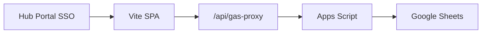

# Sustainability Dashboard

Internal dashboard for mill onboarding, supply task lists, supplier due diligence (SDD), declaration / BL monitoring, grievances, monthly reports, and related sustainability workflows.

**Stack:** Vite frontend · Google Sheets via Google Apps Script (GAS) · Vercel (`/api/gas-proxy`) · optional Supabase auth via **Hub Portal SSO**

> **Note:** This is an internal tool. Do not commit secrets (`.env.local`) or expose production credentials publicly.

---

## Features

| Area | Notes |
| --- | --- |
| Mill Onboarding | Mill registry, profiles, waste / CPO / PK supply |
| Supply Task List | Excel import → draft batches → match → submit to Mill (per-row submit + **Repair status**) |
| Supplier DD / Screening | SDD forms, screening, TML / FFB flows |
| Declaration Monitoring | Shipping / BL monitoring, Excel export |
| Monthly Report | Detail / summary PDF |
| Other panels | Grievance, No Buy List, TTM/TTP, EUDR potential, questionnaire, contacts, facility performance |

---

## Architecture



- **Frontend:** vanilla JS SPA (`src/entry.js` → `src/main.js`), HTML partials in `partials/`.
- **Data:** stored in Google Sheets; the browser talks to GAS through a server-side proxy in production.
- **Auth:** optional Hub Portal SSO via Supabase (session only — not used for business data).

Panels load lazily on first visit. Overview is the default landing page.

---

## Data flow (summary)

| Module | Flow |
| --- | --- |
| **Overview** | Show cached summary → refresh metrics in background |
| **Mill Registry** | Load mill data (cache-first) → filter / search → PDF export |
| **Supply Task List** | Import Excel → save draft → match to mills → submit → retry / repair if needed |
| **TTP / TTM** | Load monitoring data → filter by period / company → CRUD + Excel export |
| **SDD** | Import → screening → save / submit relational form |
| **Other panels** | Load sheet on first open → table + CRUD |

Operational details (sheet tabs, field mapping, API actions) live in the backend script and source code — not documented here intentionally.

---

## Quick start

```bash
npm install
cp .env.example .env.local
# Edit .env.local — at least GAS_WEBAPP_URL for local proxy
npm run dev
```

Or: `./dev.sh`

Open **`http://localhost:5340/`** (see `vite.config.js`).

For local dev without Hub redirect: `VITE_ALLOW_LOCAL_LOGIN=true` in `.env.local`.

---

## Environment

See [`.env.example`](.env.example).

| Variable | Where | Purpose |
| --- | --- | --- |
| `GAS_WEBAPP_URL` | Vercel + `.env.local` | Apps Script web app `…/exec` URL (**required**) |
| `GAS_API_SECRET` | Vercel (optional) | Must match GAS Script Property `API_SECRET` if enabled |
| `VITE_SECURE_GAS` | Build | `true` in production — browser talks only to `/api/gas-proxy` |
| `VITE_AUTH_ENABLED` | Build | `true` = require Hub SSO session |
| `VITE_HUB_PORTAL_URL` | Build | Hub origin |
| `VITE_HUB_LOGIN_PATH` | Build | Hub login path (default `/login`) |
| `VITE_ALLOW_LOCAL_LOGIN` | Build | Dev only — show local email/password form |
| `VITE_SUPABASE_URL` / `VITE_SUPABASE_ANON_KEY` | Build | Same Supabase project as Hub |

Hub SSO setup: [docs/HUB_SSO.md](docs/HUB_SSO.md).

After a new Apps Script **Deploy → New deployment**, update `GAS_WEBAPP_URL` in Vercel **and** redeploy the project.

---

## Backend (Apps Script)

Canonical script:

```text
scripts/GoogleAppsScript-backend-v3-full.gs
```

1. Paste / sync into the bound Apps Script project for the spreadsheet.
2. **Deploy → Manage deployments → Edit → New version** (or New deployment).
3. Copy the `/exec` URL into `GAS_WEBAPP_URL`.
4. Confirm required spreadsheet tabs exist.
5. Recommended: set `API_SECRET` in GAS Script Properties and `GAS_API_SECRET` on Vercel.

---

## Deploy (Vercel)

- Root: Vite build (`npm run build` → `dist`)
- Serverless proxy: [`api/gas-proxy.js`](api/gas-proxy.js)
- Config: [`vercel.json`](vercel.json)

Production should set `VITE_SECURE_GAS=true` and `VITE_AUTH_ENABLED=true` so the GAS URL stays server-side and access requires login.

---

## Scripts

```bash
npm run dev          # dev server (port 5340)
npm run dev:clean    # clear Vite cache + dev
npm run build        # production build
npm run preview      # preview prod build

npm run test:supply  # supply merge / routing / mill views
npm run test:ttp     # TTP mill sync
npm run test:period  # period filtering
npm run test:all     # all of the above + build
```

---

## Repo layout

```text
src/                 Frontend (entry, main app, panels UI, PDF/Excel helpers)
partials/            HTML panel shells included into index.html
api/gas-proxy.js     Vercel → GAS proxy
scripts/             Apps Script source + Node test helpers
vite-plugins/        Local GAS proxy for Vite
docs/                Internal integration notes (not for public exposure)
```

---

## Supply Task List — important behaviour

- Submit marks **only** rows that succeed on the server.
- Partial failures stay draft; use **Retry failed**.
- If Task List status and Mill Onboarding disagree, use **Repair status** on the batch, then Submit/Retry reopened rows.

---

## Security checklist (production)

- [ ] `VITE_AUTH_ENABLED=true`
- [ ] `VITE_SECURE_GAS=true`
- [ ] `GAS_API_SECRET` + GAS `API_SECRET` enabled
- [ ] No secrets in git (only `.env.example` with placeholders)
- [ ] Consider making the repo **private** if this remains an internal tool

---

## License

Private / internal use. Do not publish credentials or redeploy secrets publicly.
