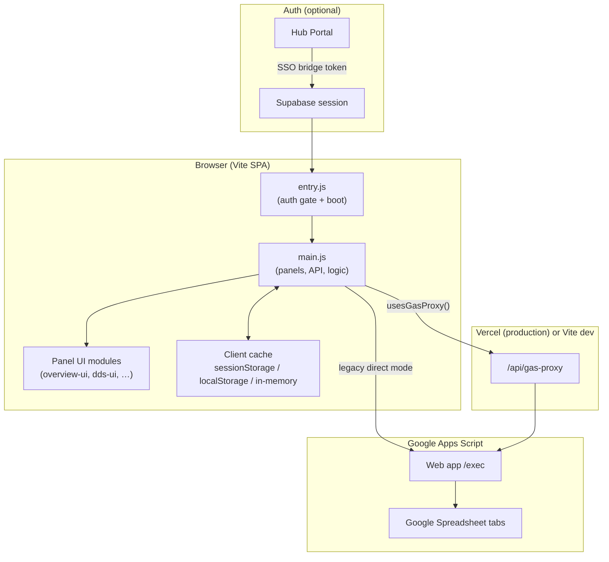
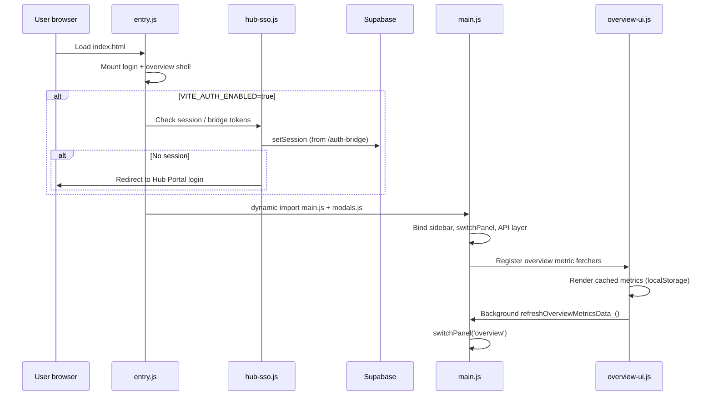
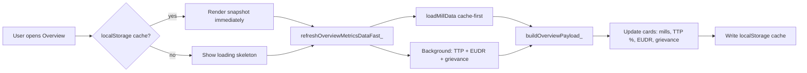
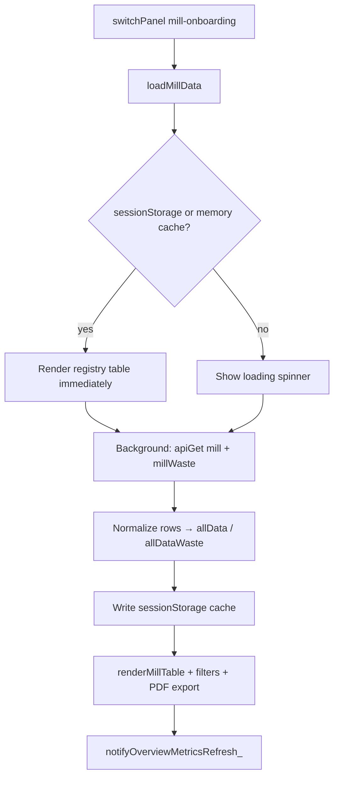
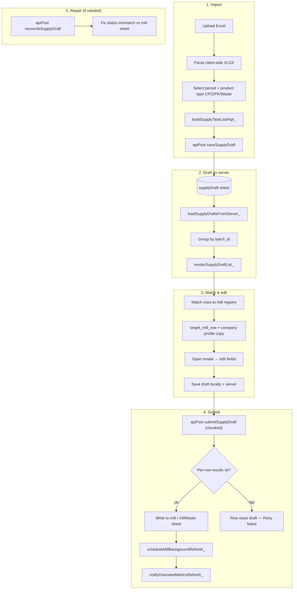
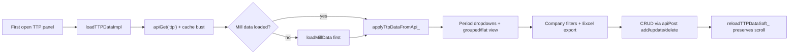
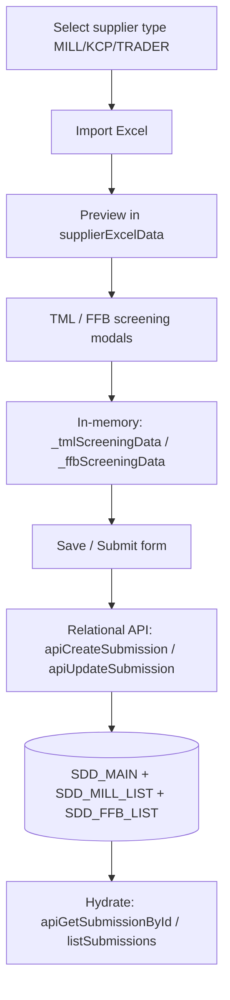
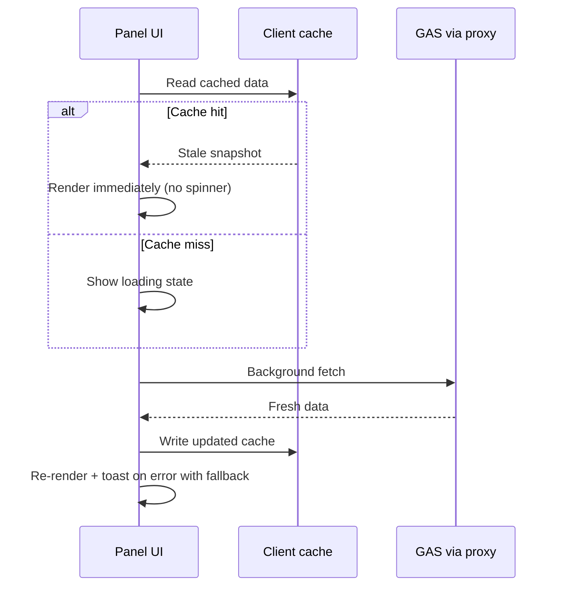
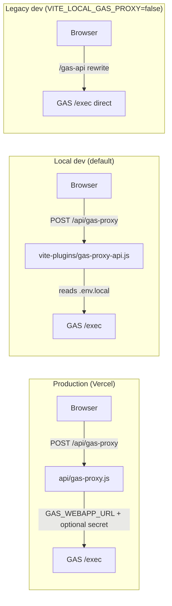

# Sustainability Dashboard

Internal web dashboard for palm-oil downstream sustainability workflows: mill onboarding, supply imports, supplier due diligence (SDD), traceability (TTM/TTP), declaration / BL monitoring, grievances, monthly reports, EUDR compliance, and related panels.

**Stack:** Vite (vanilla JS SPA) · Google Sheets via Google Apps Script (GAS) · Vercel serverless proxy · optional Supabase auth via **Hub Portal SSO**

---

## Table of contents

1. [Architecture overview](#architecture-overview)
2. [Application boot sequence](#application-boot-sequence)
3. [Data sources & storage](#data-sources--storage)
4. [GAS API layer](#gas-api-layer)
5. [Data flow by module](#data-flow-by-module)
6. [Cache-first loading](#cache-first-loading)
7. [GAS proxy — dev vs production](#gas-proxy--dev-vs-production)
8. [Features](#features)
9. [Quick start](#quick-start)
10. [Environment variables](#environment-variables)
11. [Backend (Apps Script)](#backend-apps-script)
12. [Deploy (Vercel)](#deploy-vercel)
13. [Scripts & tests](#scripts--tests)
14. [Repository layout](#repository-layout)
15. [Related docs](#related-docs)

---

## Architecture overview

The browser UI is a single-page app. **All business data lives in Google Sheets**, accessed through a GAS web app. Supabase is used **only for authentication** (Hub Portal SSO), not for operational data.



### Frontend structure

| Layer | Path | Role |
| --- | --- | --- |
| Shell | `index.html` | Includes HTML partials via `@include` |
| Boot | `src/entry.js` | CSS, XLSX global, Hub SSO gate, lazy-loads `main.js` |
| Core app | `src/main.js` | Navigation, API helpers, all panel data loaders |
| Modals | `src/modals.js` | TML / FFB screening modals (in-memory until SDD save) |
| Panel UI | `src/overview-ui.js`, `monthly-report-ui.js`, `dds-ui.js`, … | Extracted renderers for specific panels |
| GAS client | `src/gas-api-client.js` | Secure proxy routing (`usesGasProxy_`) |
| Auth | `src/hub-sso.js`, `src/supabase-client.js` | Hub redirect + session bridge |
| Partials | `partials/panel-*.html` | One HTML fragment per sidebar panel |
| Build | `vite-plugins/html-include.js` | Expands `@include` at dev/build time |
| Dev proxy | `vite-plugins/gas-proxy-api.js` | Mirrors Vercel `/api/gas-proxy` on localhost |

Navigation is driven by `switchPanel(name)` in `main.js`. The default landing panel is **Overview**; most panels lazy-load their data the first time they are opened.

---

## Application boot sequence



Key points:

- Auth gate runs **before** `main.js` downloads so the dashboard cannot open without a valid session when `VITE_AUTH_ENABLED=true`.
- Hub tokens are captured from hash/query on `/auth-bridge` before any URL cleanup.
- Overview shows **cached metrics immediately**, then refreshes in the background.

---

## Data sources & storage

### Primary — Google Sheets (via GAS)

Canonical sheet key → spreadsheet tab mapping is defined in `scripts/GoogleAppsScript-backend-v3-full.gs`:

| API `sheet` key | Spreadsheet tab |
| --- | --- |
| `mill` | Mill Onboarding Profile |
| `millWaste` | Mill Onboarding Waste |
| `supplyDraft` | Supply Import Draft |
| `ttp` | Monitoring TTP/TTM |
| `grievance` | Grievance Monitoring |
| `sdd`, `sddMain`, `sddMill`, `sddFfb` | SDD Data, SDD_MAIN, SDD_MILL_LIST, SDD_FFB_LIST |
| `nbl`, `unileverNbl` | NBL, Unilever NBL |
| `blMonitoring`, `blReference` | BL Monitoring, BL Reference |
| `eudrPotential`, `eudrStatusFormula` | EUDR Potential, EUDR Status Formula |
| `facilityProfile` | Facility Profile |
| `contactSupplier` | Contact List Supplier |
| `questionnaireMonitoring` | Questionnaire Monitoring |
| `sdMonitoring` | SD Monitoring |
| `eudrDds`, `eudrDdsSuppliers`, `eudrDdsGeolocation`, `eudrDdsDocuments` | EUDR DDS tabs |
| `riskAnalysisMitigation` | Risk Analysis & Mitigation |

### Auth — Supabase (session only)

Same Supabase project as Hub Portal. Used for SSO session persistence, **not** for mill/TTP/SDD rows.

### Client-side caches

| Cache | Storage | Key / mechanism | Used for |
| --- | --- | --- | --- |
| Mill registry | `sessionStorage` | `SDD_MILL_DATA_CACHE_V2` | Instant registry table on revisit |
| Overview metrics | `localStorage` | `sustain-dashboard.overviewMetrics.v7` | Overview hub cards |
| SDD screening | in-memory | `_scrSavedGroupsByKey`, `_scrSavedRowsByKey` | Screening list + modal prefill |
| Supply drafts | in-memory + server | `_supplyDraftSaveCache`, `_supplyDraftBatches` | Merge local edits over stale GET |
| TTP load dedup | in-memory | `ttpLoadPromise` | Prevent duplicate concurrent loads |
| MRD EUDR | in-memory | `_mrdEudrCache` | Monthly report EUDR section |
| Legacy GAS URL | `localStorage` | `SDD_WEBAPP_URL` | Direct GAS mode only |

---

## GAS API layer

All panels route through helpers in `src/main.js`:

| Helper | HTTP | Purpose |
| --- | --- | --- |
| `apiGet(sheet, opts)` | `GET ?action=getAll&sheet=<key>` | Read all rows for a sheet |
| `apiPost(body, opts)` | `POST` JSON | Writes, batch actions, relational SDD |
| `gasSecureRequest_()` | `POST /api/gas-proxy` | Used when `usesGasProxy_()` is true |
| `getSddApiUrl()` | — | Resolves direct GAS URL (legacy dev mode) |

Common POST `action` values:

| Action | Sheet / target | Description |
| --- | --- | --- |
| `add` / `update` / `delete` | any flat sheet | Row CRUD |
| `saveSupplyDraft` | `supplyDraft` | Persist Excel import batch |
| `submitSupplyDraft` | `supplyDraft` → `mill` / `millWaste` | Chunked atomic submit per row |
| `reconcileSupplyDraft` | `supplyDraft` | Repair status vs mill sheet |
| `addTtpBatch` | `ttp` | Batch TTP insert |
| `listSubmissions` / relational APIs | SDD sheets | SDD form lifecycle |
| `syncEudrPotential` | `eudrPotential` | EUDR sync from mill data |

Cache-busting: `apiGet` appends `_ts=Date.now()` for `sdd`, `ttp`, and `listSubmissions` to avoid stale reads.

Direct POST to GAS uses `Content-Type: text/plain` (not `application/json`) to avoid CORS preflight in legacy mode.

---

## Data flow by module

### 1. Overview landing

**UI:** `partials/panel-overview.html` → `#overview-root`  
**Renderer:** `src/overview-ui.js`  
**Metrics:** `buildOverviewPayload_()` in `main.js`



Aggregates: mill registry snapshot, TTP traceability totals (CPO/PK weighted by supply), EUDR counts, module navigation cards. Refreshes on tab visibility and after mill/supply changes via `notifyOverviewMetricsRefresh_()`.

---

### 2. Mill Onboarding / Mill Registry

**UI:** `partials/panel-mill-onboarding.html`  
**Logic:** `loadMillData()` / `loadMillDataImpl()` in `main.js`



Registry supports:

- Views: **All** / **Task List** (mills with pending supply)
- Period filters: All time / YTD / custom month+year
- Column filters: Group, Province, supplier status, risk level
- Executive PDF export and column-select PDF
- Profile modal per mill row

**Cache-first pattern:** `millRevealRegistryFromCacheOrMemory_()` shows data from memory or `sessionStorage` before the network round-trip. After supply submit, `scheduleMillBackgroundRefresh_()` soft-refreshes without blocking the UI.

---

### 3. Supply Task List (inside Mill Onboarding)

**UI:** Task List section in `partials/panel-mill-onboarding.html`  
**Logic:** supply section in `main.js` (~lines 28449–33328)



Important behaviour:

- Submit marks **only** rows that succeed (`results[].ok` / `draft_id` from GAS).
- Partial failures stay draft — use **Retry failed**.
- If Task List status and Mill Registry disagree, use **Repair status** on the batch.
- `window._supplyDraftSaveCache` preserves unsaved local edits when a stale GET returns.

---

### 4. TTP / TTM Monitoring

**UI:** `partials/panel-ttm-ttp.html`  
**Logic:** `loadTTPData()` / `applyTtpDataFromApi_()` in `main.js`



Field mapping from SDD → TTP: [docs/sdd-to-ttm-ttp-field-mapping.md](docs/sdd-to-ttm-ttp-field-mapping.md)

TTP traceability percentages on Overview use imputed-sum aggregation aligned with Excel footer totals (CPO: skip rows with no volume and 0%; PK: SUM(imputed) ÷ SUM(PK supply)).

---

### 5. Supplier Due Diligence (SDD)

**UI:** `partials/panel-supplier-dd.html`  
**Logic:** top of `main.js` + `modals.js`



Screening data is **in-memory only** until the SDD form is saved. Saved screening groups are cached in `_scrSavedGroupsByKey` for list view and modal prefill.

---

### 6. Other panels (lazy-loaded)

| Panel | Sheet key(s) | Loader |
| --- | --- | --- |
| Grievance | `grievance` | `loadGrvData()` |
| No Buy List | `nbl`, `unileverNbl` | `loadNoBuyListData()` |
| BL Monitoring | `blMonitoring`, `blReference` | `loadBlData()` |
| EUDR Potential | `eudrPotential`, `eudrStatusFormula` | `loadEudrData()` |
| Questionnaire | `questionnaireMonitoring` | `loadQmData()` |
| Contact List | `contactSupplier` | `loadContactListData()` |
| Company Profile List | derived from mill data | `loadCompanyProfileListData()` |
| Facility Performance | mill + TTP + supply APIs | `initPerformaFacility_()` |
| Monthly Report | aggregated in-memory | `initMonthlyReportDetail_()` → `monthly-report-ui.js` |
| Due Diligence Statement | `eudrDds*` | `initDdsPanel_()` → `dds-ui.js` |
| Risk Analysis & Mitigation | `riskAnalysisMitigation`, `sdMonitoring` | `risk-analysis-mitigation-ui.js` |

Each panel follows the same pattern: `switchPanel` → show panel DOM → call loader if not yet loaded → `apiGet` / render table → CRUD via `apiPost`.

---

## Cache-first loading

General pattern used across Mill Registry and Overview:



| Scenario | Behaviour |
| --- | --- |
| Mill registry revisit | `sessionStorage` → instant table; network refresh in background |
| Overview revisit | `localStorage` → instant cards; fast mill fetch then full refresh |
| After supply submit | Show cache first; `scheduleMillBackgroundRefresh_()` after ~18s debounce |
| TTP panel | Always cache-busts `_ts`; no persistent storage cache |
| Supply draft edit | In-memory merge protects local unsaved changes from stale GET |

---

## GAS proxy — dev vs production



Routing is decided by `usesGasProxy_()` in `src/gas-api-client.js`:

| Condition | Mode |
| --- | --- |
| `VITE_SECURE_GAS=true` | Always `/api/gas-proxy` (production) |
| Hostname `*.vercel.app` | Always `/api/gas-proxy` (auto-detected) |
| `localhost` + default settings | `/api/gas-proxy` via Vite plugin |
| `VITE_LOCAL_GAS_PROXY=false` + `VITE_SECURE_GAS=false` | Legacy `/gas-api` rewrite to `script.google.com` |
| Legacy direct mode | Browser fetches GAS `/exec` directly (CORS; URL in `window.SDD_WEBAPP_URL`) |

Production keeps `GAS_WEBAPP_URL` and `GAS_API_SECRET` server-side only — the browser never sees the raw Apps Script URL when proxy mode is active.

---

## Features

| Area | Notes |
| --- | --- |
| Overview | Hub landing with cached KPI cards; links to all modules |
| Mill Onboarding | Mill registry, profiles, CPO/PK/waste supply, executive PDF |
| Supply Task List | Excel import → draft → match → chunked submit → repair status |
| Supplier DD / Screening | SDD forms, TML / FFB screening, relational submissions |
| TTM / TTP | Trade partner / trade point monitoring, grouped views, Excel export |
| Declaration Monitoring | BL tracking, reference data, Excel export |
| Monthly Report | Compliance snapshot aggregated from mill/TTP/grievance/EUDR |
| EUDR | Potential list, Due Diligence Statement (DDS) panel |
| Other | Grievance, No Buy List, questionnaire, contacts, facility performance, risk analysis |

---

## Quick start

```bash
npm install
cp .env.example .env.local
# Edit .env.local — at minimum set GAS_WEBAPP_URL
npm run dev
```

Or: `./dev.sh`

Open **`http://localhost:5340/`** (port 5340 is configured in `vite.config.js` to avoid conflicts with other Vite apps on 5173).

For Hub SSO in local dev, set `VITE_ALLOW_LOCAL_LOGIN=true` to use email/password instead of redirecting to Hub Portal.

---

## Environment variables

See [`.env.example`](.env.example).

| Variable | Where | Purpose |
| --- | --- | --- |
| `GAS_WEBAPP_URL` | Vercel + `.env.local` | Apps Script web app `…/exec` URL (**required**) |
| `GAS_API_SECRET` | Vercel (optional) | Must match GAS Script Property `API_SECRET` if enabled |
| `VITE_SECURE_GAS` | Build | `true` in production — browser uses `/api/gas-proxy` only |
| `VITE_LOCAL_GAS_PROXY` | Build | `false` to use legacy `/gas-api` rewrite in dev |
| `VITE_AUTH_ENABLED` | Build | `true` = require Hub SSO session |
| `VITE_HUB_PORTAL_URL` | Build | Hub origin for redirect |
| `VITE_HUB_LOGIN_PATH` | Build | Hub login path (default `/login`) |
| `VITE_ALLOW_LOCAL_LOGIN` | Build | Dev only — show local email/password form |
| `VITE_SUPABASE_URL` / `VITE_SUPABASE_ANON_KEY` | Build | Same Supabase project as Hub |
| `VITE_REQUIRE_SUPABASE_AUTH` | Build | Optional stricter auth gate on API calls |

Hub SSO setup: [docs/HUB_SSO.md](docs/HUB_SSO.md)

After a new Apps Script **Deploy → New deployment**, update `GAS_WEBAPP_URL` in Vercel **and** redeploy the frontend project.

---

## Backend (Apps Script)

Canonical script:

```text
scripts/GoogleAppsScript-backend-v3-full.gs
```

Deploy steps:

1. Paste / sync into the bound Apps Script project for the spreadsheet.
2. **Deploy → Manage deployments → Edit → New version** (or New deployment).
3. Copy the `/exec` URL into `GAS_WEBAPP_URL`.
4. Confirm all spreadsheet tabs listed in the `SHEETS` constant exist.
5. If using API secret protection, set `API_SECRET` in GAS Script Properties and `GAS_API_SECRET` on Vercel.

Dev tip: without per-row `results[]` from `submitSupplyDraft`, the UI **will not** mark a whole chunk as Submitted on partial success — redeploy GAS so per-row results are available.

---

## Deploy (Vercel)

- Build: `npm run build` → static output in `dist/`
- Serverless proxy: [`api/gas-proxy.js`](api/gas-proxy.js) (120s timeout)
- SPA rewrite + security headers: [`vercel.json`](vercel.json)

Production must set:

- `GAS_WEBAPP_URL` (server)
- `VITE_SECURE_GAS=true` (build)

---

## Scripts & tests

```bash
npm run dev          # Vite dev server on port 5340
npm run dev:clean    # Clear Vite cache + dev
npm run build        # Production build → dist/
npm run preview      # Preview prod build on :4173

npm run test:supply  # supply merge, routing, mill registry views
npm run test:ttp     # TTP mill sync
npm run test:period  # period filtering
npm run test:all     # all tests + build
```

Node test scripts live in `scripts/test-*.mjs`.

---

## Repository layout

```text
index.html              SPA shell; @include partials
partials/               HTML panel fragments (panel-*.html, modals, frame)
src/
  entry.js              Boot, auth gate, lazy import main.js
  main.js               Core app: API, navigation, all panel loaders
  modals.js             TML/FFB screening modals
  gas-api-client.js     Secure GAS proxy routing
  overview-ui.js        Overview landing renderer
  monthly-report-ui.js  Monthly report panel
  dds-ui.js             EUDR Due Diligence Statement
  hub-sso.js            Hub Portal SSO bridge
  supabase-client.js    Supabase singleton
api/gas-proxy.js        Vercel serverless → GAS
vite-plugins/
  html-include.js       @include expansion
  gas-proxy-api.js      Local dev proxy mirror
scripts/
  GoogleAppsScript-backend-v3-full.gs   Canonical GAS backend
  test-*.mjs            Node unit tests
docs/
  HUB_SSO.md            Hub auth integration guide
  sdd-to-ttm-ttp-field-mapping.md
```

---

## Related docs

| Doc | Content |
| --- | --- |
| [docs/HUB_SSO.md](docs/HUB_SSO.md) | Hub Portal SSO integration, auth bridge, env setup |
| [docs/sdd-to-ttm-ttp-field-mapping.md](docs/sdd-to-ttm-ttp-field-mapping.md) | SDD → TTP field mapping reference |

---

## License

Private / internal use. Do not publish this repository or redeploy credentials publicly.
